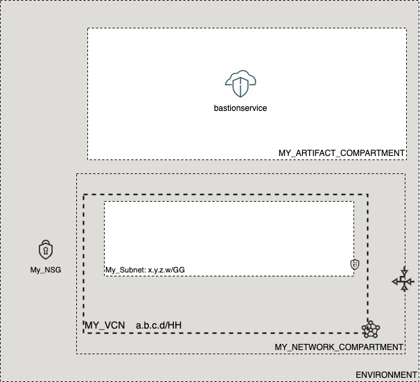

# OCI Cloud Bricks: Bastion Service

[](https://img.shields.io/badge/license-UPL-green) [](https://sonarcloud.io/dashboard?id=oracle-devrel_terraform-oci-cloudbricks-bastionservice)

## Introduction
MISSING

## Reference Architecture
The following is the reference architecture assocaited to this brick



### Prerequisites
- Pre-baked Network and Compartments Artifacts
- Pre-baked VCN

## Sample tfvar file

```shell
######################################## COMMON VARIABLES ######################################
region           = "re-region-1"
tenancy_ocid     = "ocid1.tenancy.oc1..aaaaaaaabcedfghijklmonoprstuvwxyz"
user_ocid        = "ocid1.tenancy.oc1..aaaaaaaabcedfghijklmonoprstuvwxyz"
fingerprint      = "fo:oo:ba:ar:ba:ar"
private_key_path = "/absolute/path/to/api/key/your_api_key.pem"
######################################## COMMON VARIABLES ######################################
######################################## ARTIFACT SPECIFIC VARIABLES ######################################

bastion_service_instance_compartment_name = "MY_ARTIFACT_COMPARTMENT"
bastion_service_network_compartment_name  = "MY_NETWORK_COMPARTMENT"
private_network_subnet_name               = "My_Subnet"
vcn_display_name                          = "MY_VCN"
bastion_service_name                      = "bastionservice"
allowed_client_cidr                       = ["0.0.0.0/0" , "10.0.0.0/16"] 
bastion_max_session_ttl_in_seconds        = 1800 
######################################## ARTIFACT SPECIFIC VARIABLES ######################################
```

## Variable Specific Considerations

- Variable `allowed_client_cidr` must contain unique IP addresses expressed in valid CIDR notation and you must present them as a string array. The maximum number of CIDR blocks you can have is 20.
- Variable `bastion_max_session_ttl_in_seconds` must be an integer value that is greater than or equal to 30 minutes (1800 seconds), and less than or equal to 180 minutes (10800 seconds or 3 hours)

### Sample provider
The following is the base provider definition to be used with this module

```shell
terraform {
  required_version = ">= 0.13.5"
}
provider "oci" {
  region       = var.region
  tenancy_ocid = var.tenancy_ocid
  user_ocid        = var.user_ocid
  fingerprint      = var.fingerprint
  private_key_path = var.private_key_path
  disable_auto_retries = "true"
}

provider "oci" {
  alias        = "home"
  region       = data.oci_identity_region_subscriptions.home_region_subscriptions.region_subscriptions[0].region_name
  tenancy_ocid = var.tenancy_ocid  
  user_ocid        = var.user_ocid
  fingerprint      = var.fingerprint
  private_key_path = var.private_key_path
  disable_auto_retries = "true"
}
```

## Variable documentation

## Requirements

| Name | Version |
|------|---------|
| <a name="requirement_terraform"></a> [terraform](#requirement\_terraform) | >= 0.13.5 |
| <a name="requirement_oci"></a> [oci](#requirement\_oci) | >= 4.36.0 |

## Providers

| Name | Version |
|------|---------|
| <a name="provider_oci"></a> [oci](#provider\_oci) | 4.52.0 |

## Modules

No modules.

## Resources

| Name | Type |
|------|------|
| [oci_bastion_bastion.bastion_service](https://registry.terraform.io/providers/hashicorp/oci/latest/docs/resources/bastion_bastion) | resource |
| [oci_core_subnets.PRIVATESUBNET](https://registry.terraform.io/providers/hashicorp/oci/latest/docs/data-sources/core_subnets) | data source |
| [oci_core_vcns.VCN](https://registry.terraform.io/providers/hashicorp/oci/latest/docs/data-sources/core_vcns) | data source |
| [oci_identity_compartments.COMPARTMENTS](https://registry.terraform.io/providers/hashicorp/oci/latest/docs/data-sources/identity_compartments) | data source |
| [oci_identity_compartments.NWCOMPARTMENTS](https://registry.terraform.io/providers/hashicorp/oci/latest/docs/data-sources/identity_compartments) | data source |
| [oci_identity_region_subscriptions.home_region_subscriptions](https://registry.terraform.io/providers/hashicorp/oci/latest/docs/data-sources/identity_region_subscriptions) | data source |

## Inputs

| Name | Description | Type | Default | Required |
|------|-------------|------|---------|:--------:|
| <a name="input_allowed_client_cidr"></a> [allowed\_client\_cidr](#input\_allowed\_client\_cidr) | A list of address ranges in CIDR notation that you want to allow to connect to sessions hosted by this bastion | `list` | <pre>[<br>  "0.0.0.0/0"<br>]</pre> | no |
| <a name="input_bastion_max_session_ttl_in_seconds"></a> [bastion\_max\_session\_ttl\_in\_seconds](#input\_bastion\_max\_session\_ttl\_in\_seconds) | The maximum TTL for a session initiated from the bastion | `number` | `3600` | no |
| <a name="input_bastion_service_instance_compartment_name"></a> [bastion\_service\_instance\_compartment\_name](#input\_bastion\_service\_instance\_compartment\_name) | Defines the compartment name where the infrastructure will be created | `string` | `""` | no |
| <a name="input_bastion_service_name"></a> [bastion\_service\_name](#input\_bastion\_service\_name) | Name of the Bastion Service | `string` | `"bastionservice"` | no |
| <a name="input_bastion_service_network_compartment_name"></a> [bastion\_service\_network\_compartment\_name](#input\_bastion\_service\_network\_compartment\_name) | Defines the compartment where the Network is currently located | `string` | `""` | no |
| <a name="input_bastion_service_type"></a> [bastion\_service\_type](#input\_bastion\_service\_type) | The type of bastion | `string` | `"STANDARD"` | no |
| <a name="input_fingerprint"></a> [fingerprint](#input\_fingerprint) | API Key Fingerprint for user\_ocid derived from public API Key imported in OCI User config | `any` | n/a | yes |
| <a name="input_private_key_path"></a> [private\_key\_path](#input\_private\_key\_path) | Private Key Absolute path location where terraform is executed | `any` | n/a | yes |
| <a name="input_private_network_subnet_name"></a> [private\_network\_subnet\_name](#input\_private\_network\_subnet\_name) | Defines the subnet display name where this resource will be created at | `string` | `""` | no |
| <a name="input_region"></a> [region](#input\_region) | Target region where artifacts are going to be created | `any` | n/a | yes |
| <a name="input_tenancy_ocid"></a> [tenancy\_ocid](#input\_tenancy\_ocid) | OCID of tenancy | `any` | n/a | yes |
| <a name="input_user_ocid"></a> [user\_ocid](#input\_user\_ocid) | User OCID in tenancy. | `any` | n/a | yes |
| <a name="input_vcn_display_name"></a> [vcn\_display\_name](#input\_vcn\_display\_name) | VCN Display name to execute lookup | `string` | `""` | no |

## Outputs

| Name | Description |
|------|-------------|
| <a name="output_bastionservice"></a> [bastionservice](#output\_bastionservice) | Bastion Service object |
## Contributing
This project is open source.  Please submit your contributions by forking this repository and submitting a pull request!  Oracle appreciates any contributions that are made by the open source community.

## License
Copyright (c) 2024 Oracle and/or its affiliates.

Licensed under the Universal Permissive License (UPL), Version 1.0.

See [LICENSE](LICENSE) for more details.
